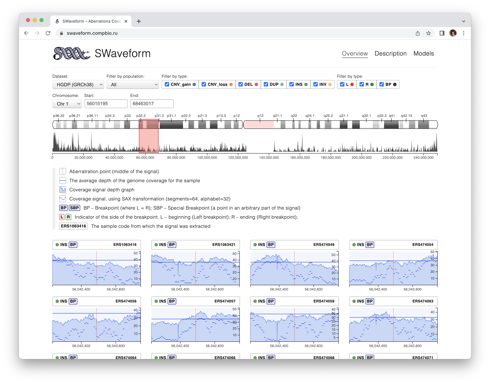

# SWaveform


## About

The repository contains a web interface for the signal database as well as a set of tools for creating a collection of signals from .bam and .vcf files.

The resource encompasses depth of coverage (DOC) signals from two large-scale sequencing initiatives delivered by the Human Genome Diversity Project (HGDP)  [Bergström, Anders et al. “Insights into human genetic variation and population history from 929 diverse genomes.” Science (New York, N.Y.) vol. 367,6484 (2020)] and Genome in a Bottle consortia (GIAB)[Zook, Justin M et al. “Extensive sequencing of seven human genomes to characterize benchmark reference materials.” Scientific data vol. 3 160025. 7 Jun. 2016]. As the latter provides variant calls and regions for use in benchmarking and validating variant calling pipelines and contains a smaller number of individuals, we envision it to be a demo collection to deploy the resource locally and to test the accompanying toolset.

The demo collection of DOC profiles contains the following samples:
* GIAB Ashkenazy; database and motifs (HG002). [_GIAB_HG002.zip (40M)](https://swaveform.compbio.ru/supplement/_GIAB_HG002.zip)
* GIAB Ashkenazy; database only, no motifs (HG002). [_GIAB_HG002_nomodel.zip (23M)](https://swaveform.compbio.ru/supplement/_GIAB_HG002_nomodel.zip)
* HGDP dataset (911 samples). [_HGDP.zip (3.2G)](https://swaveform.compbio.ru/supplement/_HGDP.zip)
* YRI, CHS and PUR family trio's children characterized in Chaisson et al [Chaisson, Mark J P et al. “Multi-platform discovery of haplotype-resolved structural variation in human genomes.” Nature communications vol. 10,1 1784. 16 Apr. 2019].

Below are instructions on 1) how to deploy a demo version of the database and 2) how to create it yourself from open source show to launch the web interface with our signal collections.


## 1. Getting started. How to deploy a local version of the database

1.1 Dependencies  
All instruments are written using `python3`, you need to install the following dependencies before you start working:

```bash
pip3 install flask tslearn gevent 
```

1.2 Download the precompiled web-interface
```bash
wget https://swaveform.compbio.ru/supplement/swaveform-13-Nov-2022.zip
unzip swaveform-13-Nov-2022.zip
```

1.3 Download signals and motifs
```bash
wget https://swaveform.compbio.ru/supplement/_GIAB_HG002.zip
unzip _GIAB_HG002.zip
```

1.4 Launch local web server with downloaded signal collection:
```bash
python3 server.py db:./_GIAB_HG002 port:8888 dev:yes
```

You're done. Now you can open your browser at [http://127.0.0.1:8888/](http://127.0.0.1:8888/)



Detailed instructions for using the web server startup script:

```text
python3 server.py \
  db:[DB path name] \
  port:[server port, default: 9915] \
  dev:[dev-mode (app.run), default: false (WSGIServer)] \
  sax:[SAX-transform width for plots, default: 64] \
  alphabet:[SAX-transform height for plots (alphabet size), default: 24]
```

!Note: You can launch the web interface based on HGDP data (large) in the same way by substituting the required data source into the `db:` parameter

```bash
wget https://swaveform.compbio.ru/supplement/_HGDP.zip
unzip _HGDP.zip
python3 server.py db:_HGDP port:8888 dev:yes
```


## 2. Detailed documentation


### 2.1 Motifs extraction

> Dataflow: (collection) -> (collection + motifs)  
> Hardware requirements: 500Mb disk space, 1GB RAM  
> Environment: Python >= 3.8, Python libraries (flask gevent tslearn h5py tslearn matplotlib PyVCF3)

```bash
pip3 install flask gevent tslearn h5py tslearn matplotlib PyVCF3
```

We have developed two versions of the database built with the  GIAB project datasets. The first one, namely, _GIAB_Ashkenazim, contains extracted motifs. The second version -, _GIAB_Ashkenazim_nomodel, contains only DOC signals and is intended primarily  for testing the motif extraction workflow using the provided instruments and tools. Therefore, you may skip.

2.1.1 Download repository and database-without-motifs (**_GIAB_Ashkenazim_nomodel.zip**):

```bash
git clone https://github.com/latur/SWaveform.git && cd ./SWaveform
wget https://swaveform.compbio.ru/supplement/_GIAB_HG002_nomodel.zip
unzip _GIAB_HG002_nomodel.zip
```

2.1.2 Clustering of DOC profiles and motif extraction from the clusters with bootstrap

To speed up the motifs discovery, as the process may be time and resource consuming it is possible to run it on different workstations and combine the results at the end.

Usage:

```text
python3 ./tools/Clusters_ADAKMS_bootstrap.py \
  db:[DB path name] \
  name:[dataset name] \
  type:[SV type and side, ex: DEL_L] \
  sax:[SAX-transform width, default: 64] \
  alphabet:[SAX-transform height (alphabet size), default: 24] \
  window:[motif width, default: 32] \
  dataset:[signals count for each run, default: 400] \
  repeats:[repeats count for bootstrap, default: 20] \
  seed:[seed for K-means]
```

An example of searching for a motif for the left deletion breakpoint (type:DEL side:L):

```bash
python3 ./tools/Clusters_ADAKMS_bootstrap.py db:_GIAB_HG002_nomodel repeats:20 dataset:800 type:DEL side:L name:GIAB &
# Time:   40 min. (2422 sec.)
# Memory: 567MB
# Result: _GIAB_HG002_nomodel/adakms/GIAB_DEL_L_s64-24_w32_d800_r20_s1337.json
```

2.1.3 Combining the motifs found at the first stage

Each bootstrap run generates one or two clusters, each cluster yields up to 5 most significant motifs. These are further merged into one most representative motif `./tools/Clusters_ADAKMS_align.py`:

Usage:

```text
python3 ./tools/Clusters_ADAKMS_align.py \
  db:[DB path name] \
  prefix:[dataset name]_[motif type]
```

Example for search for motifs of all types for the GIAB_HG002-database:

```bash
python3 ./tools/Clusters_ADAKMS_bootstrap.py db:_GIAB_HG002_nomodel repeats:10 dataset:600 type:DEL side:L name:GIAB
python3 ./tools/Clusters_ADAKMS_align.py db:_GIAB_HG002_nomodel prefix:"GIAB_DEL_L"
# Time:   10 min. (607 sec.)                                                                                                                                      
# Memory: 168MB                                                                                                                                                   
# Result: _GIAB_HG002_nomodel/adakms/GIAB_DEL_L_s64-24_w32_d600_r10_s1337.json  

python3 ./tools/Clusters_ADAKMS_bootstrap.py db:_GIAB_HG002_nomodel repeats:10 dataset:600 type:DEL side:R name:GIAB
python3 ./tools/Clusters_ADAKMS_align.py db:_GIAB_HG002_nomodel prefix:"GIAB_DEL_R"
# Time:   9 min. (591 sec.)                                                                                                                                       
# Memory: 169MB                                                                                                                                                   
# Result: _GIAB_HG002_nomodel/adakms/GIAB_DEL_R_s64-24_w32_d600_r10_s1337.json   

python3 ./tools/Clusters_ADAKMS_bootstrap.py db:_GIAB_HG002_nomodel repeats:10 dataset:600 type:INS side:BP name:GIAB
python3 ./tools/Clusters_ADAKMS_align.py db:_GIAB_HG002_nomodel prefix:"GIAB_INS_BP"
# Time:   18 min. (1095 sec.)
# Memory: 344MB
# Result: _GIAB_HG002_nomodel/adakms/GIAB_INS_BP_s64-24_w32_d600_r10_s1337.json
```

Memory and speed calculations are measured for running in a single thread on a device with the following specifications:

```text
Architecture:        x86_64
CPU op-mode(s):      32-bit, 64-bit
CPU(s):              32
Thread(s) per core:  2
Core(s) per socket:  8
Model name:          Intel(R) Xeon(R) CPU E5-2640 v3 @ 2.60GHz
```


### 2.2 Building your own database for your sequencing project

!Note: Creating your own collection of signals requires a lot of disk space to store bam files. Each bam file can be up to 300gb

> Hardware requirements: 2GB disk space, 1GB RAM  
> Environment: Python >= 3.8, Python libraries (PyVCF3)

2.2.1 Generate coverage files (.bcov) from sequencing data


> Dataflow 1: (.bam or .cram) -> mosdepth -> (.per-base.bed.gz) -> bed2cov -> (.bcov)

Extracting depth-of-coverage (DOC) from .cram files is done using [mosdepth](https://github.com/brentp/mosdepth)
To extract DOC values from .cram files you need a reference genome:
http://ftp.ensembl.org/pub/current_fasta/homo_sapiens/dna/Homo_sapiens.GRCh38.dna.toplevel.fa.gz

Example:

```bash
for crm in $(ls *.cram); do
  code=${crm/.cram/}
  mosdepth -t 24 -f Homo_sapiens.GRCh38.dna.toplevel.fa "$code" "$crm"
done;
```

As a result, for every sample BED files containing DOC are created in the current directory. These files should be further converted into .bcov format using a tool from our repository (~/SWaveform/bed2cov/bed2cov). Example:

```bash
for crm in $(ls *.cram); do
  code=${crm/.cram/}
  mkdir -p $code && cd $code
  echo -e "\033[37m.bed -> .bcov $code [$(date)]\033[0m";
  gzip -cd ../"$code".per-base.bed.gz | ./bed2cov/bed2cov
  cd ../
done
```

2.2.2 The .meta file

The .meta file is a table which contains .VCF to .BCOV file relationships i.e. indicates which sample corresponds to which DOC signal.  
Columns: `sample_accession` `sample` `population` `sex` `meancov`  
`sample_accession` — sample name in vcf file  
`sample` is the name of the .bcov coverage data directory  
`population` `sex` `meancov` — fields for the database

Example:

```text
sample_accession sample population sex meancov
NA12878 HG001 Default F 272.02
HG002 HG002 Ashkenazim M 53.27
HG003 HG003 Ashkenazim M 45.94
HG004 HG004 Ashkenazim F 52.54
HG005 HG005 Chinese M 14.96
HG006 HG006 Chinese M 17.26
HG007 HG007 Chinese F 16.65
```

```
┌─────────────────┬───────┬───────────┬────┬────────┐
│sample_accession │sample │population │sex │meancov │
├─────────────────┼───────┼───────────┼────┼────────┤
│NA12878          │HG002  │Ashkenazim │F   │272.02  │
└─┬───────────────┴─┬─────┴─┬─────────┴────┴─┬──────┘
  │                 │       │                │
  ▼                 │       ▼                │
 Sample name        │      Population        │
 from .vcf file     │      name (any string) └────────┐
                    ▼                                 │
 Directory name with depth-of-coverage (DOC) values.  │
 For example, DOC values for NA12878 are located in   │
 directory HG002: /path-to-bcov/HG002/chr{1..22}.bcov │
                                                      │
 Mean coverage for the genome. The value is in file ◄─┘
 *.mosdepth.summary.txt, line:total
```


2.2.3. Import VCF files and create database (tools `./tools/import_vcf.py` `./tools/import_coverage.py`):

> Dataflow 2: (.bcov + .meta + .vcf) -> (collection)

Usage:

```text
python3 ./tools/import_vcf.py \
  db:[DB path name] \
  vcf:[vcf or vcf.gz file] \
  meta:[metadata file] \
  name:[dataset file] \
  offset:[BND offset in bases (integer, >16, default: 256)] \
  genome:[human genome version, default GRCh38] \
  special:[if SV is less than this parameter, store it as an additional
    breakpoint with type `SBP`, default: 0*] \
  spp:[number from 0 to 1. Specify the center of SV around which offset 
    will be taken, default: 0.5*]
```

**Special SV (`special` & `spp`):**

If you want to save a signal around a small size SV to the database, you can
use the `special` and `spp` options. All SVs greater than the `special`
parameter will not be added to the database. `spp` is responsible for the
position of the point around which `offset` will be taken. The point is
calculated relative to the SV size: `SBP = L + (R - L) * spp`. For example,
if you specify `spp` = 0.5, then for the deletion in coordinates 3000–3024,
center is 3012. The signal from segment 3012±256 [2756–3268] will be stored
in the database

Example:

```bash
for vcf in /projects/HGDP/SV/*.vcf; do
  python3 ./tools/import_vcf.py db:_HGDP \
   name:HGDP vcf:$vcf \
   meta:HGDP/HGDP.metadata
done
```

Once all VCF files have been imported, download the corresponding region coverage signals.

Usage:

```text
python3 ./tools/import_coverage.py \
  db:[DB directory] \
  path:[coverage directory] \
  name:[dataset name]
```

Example:
```bash
python3 ./tools/import_coverage.py db:_HGDP name:HGDP path:HGDP/cram/
```


### 2.3 Interface deployment (for JavaScript developers)

To work on the interface, we used React.
For development use hot-reload server:

```bash
yarn install #Once
yarn server
```

To build JavaScript code, use the command:

```bash
yarn build && yarn pub
```

The interface ready for publishing will be compiled into an archive like this: `swaveform-$(date +%d-%b-%Y).zip`
